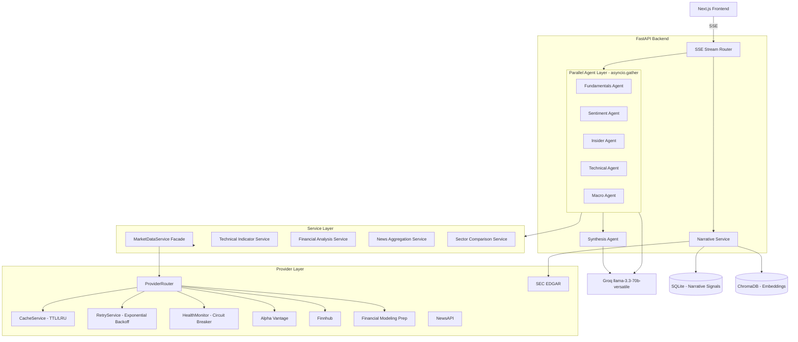

# StockLens

**Multi-Agent AI Stock Research Platform with Divergence Intelligence**

🔗 **Live App:** [stocklens-peach.vercel.app](https://stocklens-peach.vercel.app)
🔗 **API:** [web-production-b35b3.up.railway.app](https://web-production-b35b3.up.railway.app)
🔗 **API Health:** [/health/providers](https://web-production-b35b3.up.railway.app/health/providers)

---

## The Problem

Single-source stock research tools — analyst reports, news aggregators, technical screeners — give one viewpoint and call it analysis. Real investment decisions break down across dimensions that frequently *disagree*:

- **Fundamentals look strong** but **insiders are dumping shares**
- **Sentiment is euphoric** but **technicals are overbought and rolling**
- **Macro is risk-off** but **the company is gaining share**

The interesting signal isn't any single perspective — it's the **disagreement between them**. Most retail tools collapse this conflict into a single buy/hold/sell rating. StockLens does the opposite: it runs five specialist agents in parallel, surfaces where they disagree, and quantifies that conflict as a **Divergence Score**.

---

## The Core Insight: Divergence Intelligence

Each agent produces a normalized output:

```python
class AgentOutput(BaseModel):
    score: float        # -1 (bearish) to +1 (bullish)
    confidence: float   # 0 to 1
    summary: str
    evidence: list[Evidence]
```

The **Synthesis Agent** computes:

- **Divergence Score** — weighted standard deviation of agent scores, surfacing how much the agents disagree
- **Consensus Score** — confidence-weighted average score
- **Divergence Matrix** — pairwise disagreement (5×5 heatmap) so you can see exactly which agent pair conflicts most
- **LLM-synthesized Bull Thesis / Bear Thesis / Verdict** — grounded in agent evidence, not hallucinated

**High divergence isn't a bug — it's the alpha.** A stock where Fundamentals says +0.8 and Insider says -0.7 is far more interesting than one where everyone agrees.

---

## Architecture



### Why this layering matters

- **Provider Router** abstracts five free-tier APIs behind one interface. When Alpha Vantage hits its 25/day cap, FMP takes over. When FMP is rate-limited, Finnhub serves. Each provider has a health monitor with a circuit breaker — failing providers are skipped until cooldown.
- **Cache + Retry as cross-cutting concerns** — every external call goes through TTL caching and exponential-backoff retry, so the agents themselves stay clean of infrastructure concerns.
- **Parallel agent execution via `asyncio.gather`** — total analysis latency ≈ slowest agent, not sum of all agents.
- **SSE streaming** — agents post results to the frontend as they complete, so the user sees Fundamentals in 2s rather than waiting 15s for everything.
- **Graceful degradation** — every agent builds raw evidence and summary *before* the LLM call. If the LLM fails or rate-limits, the agent still returns a real score from primary-source data.

---

## The Five Agents

Each agent is a Python module under `backend/agents/` inheriting a common `BaseAgent` that handles LLM calls, JSON parsing, and evidence formatting.

| Agent | Primary Sources | What it Scores |
|-------|-----------------|----------------|
| **Fundamentals** | FMP — income statement, balance sheet, cash flow, ratios | Profitability, growth, capital efficiency, valuation |
| **Sentiment** | NewsAPI, Finnhub news, Reuters/CNBC headlines | News tone, narrative momentum, media coverage skew |
| **Insider** | Finnhub insider transactions API | Executive buying/selling patterns, net insider flow, cluster activity |
| **Technical** | FMP/Finnhub OHLCV + `ta` library | RSI, MACD, moving averages, momentum/trend regime |
| **Macro** | XLK/sector ETF comparison, broader index data | Sector-relative strength, beta, macro headwind/tailwind |

The **Insider Agent** is particularly notable — it surfaces real executive names and dollar amounts from Form 4 filings (e.g., AAPL: *LEVINSON ARTHUR D — $86.74M total selling, BORDERS BEN, PAREKH KEVAN*). This is primary-source SEC data, not aggregated sentiment.

---

## Longitudinal Narrative Intelligence

A second axis of analysis: **how does the company's own story change over time?**

The Narrative Service:

1. Fetches the last 4 quarters of 10-Q filings from SEC EDGAR
2. Extracts the MD&A section using BeautifulSoup
3. Uses the **Signal Extractor** — an LLM-driven module — to pull out concrete claims about strategy, risks, opportunities, and concerns *with verbatim quotes*
4. Stores extracted signals in SQLite (`narrative_signals.db`) so judges and demo users get instant load

Example: For NVDA Q1, the system surfaces the actual 10-Q sentence: *"Revenue for the first quarter was $81.6 billion..."* with the quarter, signal type, and confidence — not paraphrased, the actual text from the filing.

Pre-processed tickers: **AAPL, NVDA, MSFT, META**.

---

## Tech Stack

### Backend
- **Python 3.11** + **FastAPI** + **Uvicorn**
- **Groq API** — `llama-3.3-70b-versatile` for all LLM calls 
- **asyncio.gather** for parallel agent execution
- **Server-Sent Events (SSE)** for streaming agent results to the client
- **sentence-transformers** + **ChromaDB** for embeddings (used in narrative similarity)
- **BeautifulSoup4** for SEC filing parsing
- **ta** (technical indicators — RSI, MACD, MAs)
- **SQLite** for narrative signal persistence
- **httpx** as async HTTP client

### Frontend
- **Next.js 14** (App Router) + **React 18** + **TypeScript**
- **Tailwind CSS** + **shadcn/ui** components
- **Recharts** for price charts and divergence visualizations
- **next-themes** for dark/light mode (theme-aware CSS variables throughout)
- **EventSource API** for SSE consumption

### Data Providers
- **Financial Modeling Prep** — primary fundamentals + OHLCV
- **Finnhub** — quotes, insider transactions, news
- **Alpha Vantage** — fallback fundamentals + indicators
- **SEC EDGAR** — 10-Q filings (free, no key)
- **NewsAPI** — general news aggregation

### Infrastructure
- **Backend:** Railway Hobby plan (Procfile + nixpacks)
- **Frontend:** Vercel (free tier)
- **Persistence:** SQLite committed to repo for narrative cache; ChromaDB on-disk

---

## Project Structure

```
mdg/
├── main.py                       # FastAPI entry, SSE routes, endpoint definitions
├── Procfile                      # Railway deploy command
├── railway.json
├── runtime.txt
├── nixpacks.toml
├── requirements.txt
├── narrative_signals.db          # Pre-processed narrative cache (committed)
│
├── agents/
│   ├── base.py                   # BaseAgent + call_llm helper with schema_fallback
│   ├── fundamentals.py
│   ├── sentiment.py
│   ├── insider.py
│   ├── technical.py
│   ├── macro.py
│   └── synthesis.py              # Divergence + consensus + bull/bear thesis
│
├── analytics/
│   ├── technical_indicator_service.py
│   ├── financial_analysis_service.py
│   ├── news_aggregation_service.py
│   └── sector_comparison_service.py
│
├── providers/
│   ├── models.py                 # Quote, Fundamentals, etc.
│   ├── cache_service.py          # TTL + LRU
│   ├── retry_service.py          # Exponential backoff
│   ├── health_monitor.py         # Circuit breaker
│   ├── alpha_vantage_provider.py
│   ├── finnhub_provider.py
│   ├── fmp_provider.py
│   ├── provider_router.py        # Multi-provider orchestration
│   └── market_data_service.py    # Facade over providers
│
├── narrative/
│   ├── models.py                 # SQLite schemas
│   ├── sec_parser.py             # 10-Q MD&A extraction
│   ├── signal_extractor.py       # LLM-driven claim extraction
│   └── narrative_service.py
│
├── utils/
│   └── parsing.py                # parse_llm_json — balanced-brace JSON extractor
│
└── frontend/
    ├── package.json
    ├── next.config.js
    └── src/
        ├── app/
        │   ├── page.tsx          # Main dashboard
        │   ├── layout.tsx
        │   └── globals.css       # Theme-aware CSS vars
        ├── components/
        │   ├── MarketTickerBar.tsx
        │   ├── ScreenerTable.tsx
        │   ├── BreakingNews.tsx
        │   ├── MarketSentimentPanel.tsx
        │   ├── DivergencePanel.tsx
        │   ├── DivergenceMatrix.tsx
        │   ├── AnalystPanel.tsx
        │   ├── NarrativeTimeline.tsx
        │   ├── SynthesisPanel.tsx
        │   ├── PriceChart.tsx
        │   └── InfoTooltip.tsx
        ├── hooks/
        │   └── useBatchQuotes.ts
        └── lib/
            └── glossary.ts       # Financial term tooltips
```

---

## API Endpoints

| Method | Path | Purpose |
|--------|------|---------|
| `GET` | `/analyze/{ticker}` | **SSE stream** — emits agent results as they complete, ends with synthesis |
| `POST` | `/quotes/batch` | Batch quote fetch for screener / ticker bar |
| `GET` | `/news/market` | Aggregated breaking market news |
| `GET` | `/market/sentiment` | Computed Fear & Greed Index value |
| `GET` | `/recommendations/{ticker}` | Wall Street analyst consensus |
| `GET` | `/narrative/{ticker}` | Cached longitudinal narrative signals |
| `POST` | `/narrative/{ticker}/preprocess` | Build narrative cache for a new ticker |
| `GET` | `/health/providers` | Provider health, rate-limit status, circuit breaker state |

---

## Setup

### Prerequisites
- Python 3.11
- Node.js 18+
- API keys (all have free tiers): Groq, NewsAPI, Alpha Vantage, Finnhub, FMP

### Backend

```bash
git clone https://github.com/prnb007/Multi-Agent-RAG-Based-Stock-Research-Platform-with-Divergence-Intelligence.git
cd Multi-Agent-RAG-Based-Stock-Research-Platform-with-Divergence-Intelligence

python3.11 -m venv venv
source venv/bin/activate          # Windows: venv\Scripts\activate
pip install -r requirements.txt
```

Create a `.env` file in the project root:

```env
GROQ_API_KEY=your_groq_key
NEWS_API_KEY=your_newsapi_key
ALPHA_VANTAGE_KEY=your_av_key
FINNHUB_API_KEY=your_finnhub_key
FMP_API_KEY=your_fmp_key
SEC_EMAIL=your_email@example.com
```

Run the server:

```bash
uvicorn main:app --reload --port 8000
```

Sanity check: `http://localhost:8000/health/providers`

### Frontend

```bash
cd frontend
npm install
```

Create `frontend/.env.local`:

```env
NEXT_PUBLIC_API_URL=http://localhost:8000
```

Run the dev server:

```bash
npm run dev
```

Open `http://localhost:3000`.

### Pre-processing narrative data (optional)

To populate the narrative cache for a new ticker:

```bash
curl -X POST http://localhost:8000/narrative/TSLA/preprocess
```

This fetches the last 4 quarters of 10-Q filings, parses MD&A, and stores extracted signals in `narrative_signals.db`. Takes 30–60s per ticker depending on LLM throughput.

---

## Repository

[github.com/prnb007/Multi-Agent-RAG-Based-Stock-Research-Platform-with-Divergence-Intelligence](https://github.com/prnb007/Multi-Agent-RAG-Based-Stock-Research-Platform-with-Divergence-Intelligence)

